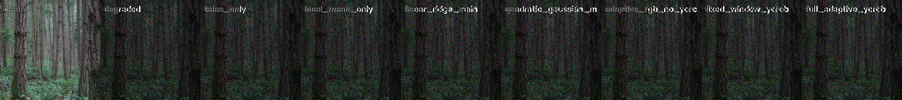
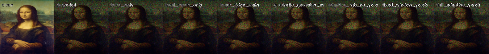
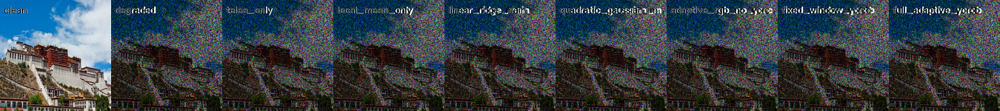
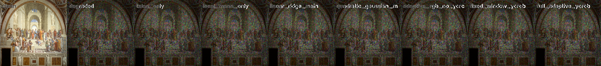
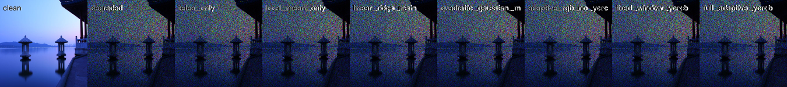

# 图像恢复重建实验报告

> **课题**：基于局部加权岭回归与色度校正的图像恢复重建
>
> **环境**：Python 3 + NumPy + OpenCV，Windows 11，conda `torch` 环境
>
> **日期**：2026年7月

---

## 一、课题背景与目标

### 1.1 问题描述

图像在获取、传输、存储过程中可能因多种原因受到噪声干扰。本课题聚焦于**随机像素缺失（Random Pixel Loss）**场景：对 RGB 图像的每个通道、每一行，独立随机选取一定比例的像素置零，需要从剩余的稀疏已知像素中恢复完整的原始图像。

默认噪声比率为：R 通道 80%、G 通道 40%、B 通道 60% 的像素置零。

设原始图像为 $I \in [0,1]^{H \times W \times C}$，噪声掩码 $M \in \{0,1\}^{H \times W \times C}$，则受损图像为：

$$I_{\text{noisy}}(i,j,k) = I(i,j,k) \cdot M(i,j,k)$$

其中对每个通道 $k$ 和每行 $i$，满足 $\sum_{j=1}^{W} [M(i,j,k)=0] = \lfloor W \cdot r_k \rceil$，$r_k$ 为该通道的噪声比率。

### 1.2 现有方法的局限

| 方法类别 | 局限性 |
|---|---|
| 中值滤波 / 均值滤波 | 仅利用局部一阶统计量，高频纹理丢失严重 |
| Telea Inpainting | 基于像素传播的启发式方法，缺乏对图像结构的显式建模 |
| 深度学习（CNN / GAN） | 需要大量训练数据，无法用于单张图像的"零样本"恢复 |

### 1.3 本课题方案概述

本课题提出一种**不依赖训练数据**的图像恢复方法，核心思路为：

1. **高斯加权局部二次岭回归**：对每个缺失像素，利用其邻域内已知像素拟合一个局部二次曲面，用该曲面在缺失位置的值作为估计；
2. **YCrCb 色度校正**：在 YCrCb 色彩空间对色度通道重新恢复，利用人眼对色度信息更不敏感的特性减少色彩伪影；
3. **三窗口级联填补**：从小到大三个窗口逐步填补缺失像素，平衡局部精度与覆盖率；
4. **消融实验验证**：通过系统的消融实验，量化每个设计选择对恢复质量的贡献。

---

## 二、已完成的工作

### 2.1 数据与实验设置

#### 2.1.1 测试数据

| 类别 | 图像 | 数量 | 说明 |
|---|---|---|---|
| 自备测试图 | `A.png` | 1 张 | 本地主要测试图像 |
| 公开样本 | forest, mona_lisa, potala_palace, school_of_athens, xihu | 5 张 | 覆盖自然景观、人物肖像、建筑等不同场景 |

**生成噪声测试集**（共 6 组）：

| 参数 | 取值 |
|---|---|
| 噪声比例 | `[0.8, 0.4, 0.6]`（R重噪），`[0.4, 0.6, 0.8]`（B重噪） |
| 随机种子 | 7, 42, 2026 |
| 图像尺寸 | 统一缩放至 150×150 |

**样本噪声测试集**（共 5 组）：使用 `samples/` 目录下的预生成噪声图像，噪声分布与生成方式不同，用于测试方法泛化能力。

#### 2.1.2 评估指标

| 指标 | 公式 | 含义 |
|---|---|---|
| L2 误差 | $\|I_{\text{restored}} - I_{\text{clean}}\|_2$ | 逐像素欧氏距离，越小越好 |
| SSIM | 结构相似度 (Wang et al., 2004) | 亮度 + 对比度 + 结构的综合相似度 |
| 余弦相似度 | $\frac{\mathbf{I}_r \cdot \mathbf{I}_c}{\|\mathbf{I}_r\| \cdot \|\mathbf{I}_c\|}$ | 向量方向一致性，越接近 1 越好 |
| PSNR | $10\log_{10}(1 / \text{MSE})$ | 峰值信噪比（dB），越大越好 |

#### 2.1.3 平台环境

- **语言与库**：Python 3 + NumPy + OpenCV (cv2)
- **硬件**：无 GPU 依赖，CPU 即可运行
- **操作系统**：Windows 11
- **环境管理**：conda `torch` 环境

---

### 2.2 算法设计

#### 2.2.1 总体流程

```
原始图像 I
    │
    ▼
┌──────────────────────┐
│ 噪声生成              │  noise_mask_image()
│ M(i,j,k) ~ 按行随机掩码 │
└──────────────────────┘
    │
    ▼
受损图像 I_noisy = I ⊙ M
    │
    ▼
┌─────────────────┐
│ 掩码提取         │  get_noise_mask()
│ known = (pixel ≠ 0) │
└─────────────────┘
    │
    ▼
┌──────────────────────────────────────┐
│     RGB 通道独立回归恢复               │
│  每通道: 高斯加权 → 二次特征 → 岭回归   │
│  三窗口级联 (r → 2r → 4r)            │
└──────────────────────────────────────┘
    │
    ▼
┌─────────────────┐
│ YCrCb 色度校正   │
│ RGB→YCrCb→色度重恢复→RGB │
└─────────────────┘
    │
    ▼
恢复图像 I_restored
```

#### 2.2.2 噪声生成模块

函数 `noise_mask_image(img, noise_ratio=[0.8, 0.4, 0.6])` 实现：

1. 解析 `noise_ratio`，适配不同通道数（支持单通道灰度图和 RGB 图）
2. 对每个通道的每一行，独立随机选取 $\lfloor W \times r_k \rceil$ 个列位置置零
3. 输出与输入形状一致的受损图像，像素值范围 $[0,1]$，类型 `np.double`

**关键实现细节**：
- 使用 `np.random.choice(width, size=zero_count, replace=False)` 确保每行恰好选取指定数量的缺失像素
- 掩码生成后与原图逐元素相乘，已知像素值完全保留

#### 2.2.3 高斯加权局部二次岭回归（核心算法）

**动机**：对每个缺失像素，利用其邻域内已知像素拟合一个局部二次曲面，用该曲面在缺失位置的值作为估计。高斯加权确保靠近中心的像素对拟合贡献更大，岭正则化保证数值稳定性。

---

**步骤一：定义特征空间**

以缺失像素 $(x_0, y_0)$ 为中心，对邻域内每个已知像素 $(x_i, y_i)$，构建归一化偏移向量（$r$ 为窗口半径）：

$$dx_i = \frac{x_i - x_0}{r}, \quad dy_i = \frac{y_i - y_0}{r}$$

二次特征向量 $\mathbf{x}_i \in \mathbb{R}^6$：

$$\mathbf{x}_i = [dx_i,\; dy_i,\; dx_i^2,\; dy_i^2,\; dx_i dy_i,\; 1]^T$$

前 5 维捕获局部曲面的二次形状（倾斜、弯曲、扭转），第 6 维常数项提供基线偏移。

---

**步骤二：高斯空间加权**

距中心越近的像素对拟合贡献越大：

$$w_i = \exp\left(-\frac{dx_i^2 + dy_i^2}{2\sigma^2}\right), \quad \sigma = 0.55$$

σ = 0.55 意味着在 1 个归一化半径处权重衰减至约 $e^{-1/(2 \times 0.55^2)} \approx 0.19$，窗口边缘贡献约为中心的 1/5。这种衰减使得模型在捕捉局部结构的同时不受远处无关像素的干扰。

---

**步骤三：加权岭回归求解**

设邻域内有 $n$ 个已知像素，观测值为 $\{y_i\}_{i=1}^n$。目标函数为：

$$\mathcal{L}(\beta) = \sum_{i=1}^{n} w_i (y_i - \mathbf{x}_i^T \beta)^2 + \lambda \|\beta\|_2^2$$

矩阵形式（$W = \text{diag}(w_1,\ldots,w_n)$，$X \in \mathbb{R}^{n\times 6}$，$\mathbf{y} \in \mathbb{R}^n$）：

$$\hat{\beta} = (X^T W X + \lambda I^*)^{-1} X^T W \mathbf{y}$$

其中 $I^*$ 为**修正单位阵**：

$$I^*_{i,j} = \begin{cases} 1 & i = j \neq 6 \\ 1 - 0.999\lambda & i = j = 6 \\ 0 & i \neq j \end{cases}$$

**$I^*$ 的设计意图**：常数项 $\beta_6$ 对应的特征始终为 1，不受邻域位置影响。标准岭回归会将常数项也向 0 收缩，导致预测值系统性偏低。减去 $0.999\lambda$ 使常数项几乎不受惩罚，保留其拟合全局亮度偏移的能力。

---

**步骤四：预测**

缺失像素 $(x_0, y_0)$ 在归一化坐标中为 $(0, 0)$，预测值即为常数项：

$$\hat{y}_0 = \mathbf{x}_0^T \hat{\beta} = [0, 0, 0, 0, 0, 1] \cdot \hat{\beta} = \hat{\beta}_6$$

---

**步骤五：自适应正则化强度**

$$\lambda = \lambda_{\text{base}} \cdot \max(w_{\text{count}}, 1.0)$$

其中 $w_{\text{count}} = \sum_{i \in \mathcal{N}} w_i$ 为加权邻域已知像素数。

| 模式 | $\lambda_{\text{base}}$ | 设计原因 |
|---|---|---|
| RGB / Y（亮度） | $10^{-3}$ | 亮度细节丰富，弱正则化以保留纹理 |
| Chroma（Cr/Cb 色度） | $2 \times 10^{-3}$ | 色度平滑变化，强正则化抑制伪彩色 |

已知像素越多 → $\lambda$ 越大 → 正则化越强，防止在样本密集区域过拟合局部噪声。这是一种简单而有效的自适应策略。

---

#### 2.2.4 三窗口级联策略

**设计动机**：单一窗口存在"小窗口覆盖不足 vs 大窗口结构不精确"的矛盾。

| 轮次 | 窗口半径 | 最少已知样本数（RGB/Chroma） | 作用 |
|---|---|---|---|
| 第 1 轮 | r = 4 | ≥ 8 / ≥ 10 | 小窗口高精度恢复邻域密集区域 |
| 第 2 轮 | 2r = 8 | ≥ 8 / ≥ 10 | 中等窗口补充稀疏区域 |
| 第 3 轮 | 4r = 16 | ≥ 8 / ≥ 10 | 大窗口兜底恢复孤立缺失像素 |

每轮仅处理**该轮窗口下已知样本数达标、且前几轮未填补**的缺失像素。未被任何轮次覆盖的像素回退为局部加权均值。这种从精细到粗略的级联策略，确保每个缺失像素都在"尽量小的窗口、尽量多的已知信息"条件下被恢复。

---

#### 2.2.5 多源融合

单通道恢复结果由三部分线性组合：

$$I_{\text{restored}} = \alpha_{\text{inpaint}} \cdot I_{\text{inpaint}} + \alpha_{\text{reg}} \cdot I_{\text{regression}} + \alpha_{\text{mean}} \cdot I_{\text{local\_mean}}$$

| 模式 | $\alpha_{\text{inpaint}}$ | $\alpha_{\text{reg}}$ | $\alpha_{\text{mean}}$ | 设计理念 |
|---|---|---|---|---|
| RGB | 0.35 | 0.55 | 0.10 | 偏重回归的高频细节恢复 |
| Y（亮度） | 0.25 | 0.65 | 0.10 | 最大化纹理恢复 |
| Chroma（色度） | 0.20 | 0.35 | 0.45 | 偏重局部均值，产生平滑自然的色彩 |

三个来源各有侧重：Telea Inpainting 提供结构连贯性（尤其在边缘区域），岭回归提供高频纹理细节，局部均值提供稳定的基线估计。按模式调整权重可针对性优化不同通道的恢复质量。

---

#### 2.2.6 YCrCb 色度校正

**动机**：RGB 三通道独立恢复会产生通道间不一致性——每个通道的回归误差方向独立，$(ε_R, ε_G, ε_B)$ 合成后呈现为肉眼可见的彩色斑点。

**流程**：

```
步骤 1: RGB 三通道独立回归恢复 → I_rgb_direct
步骤 2: I_rgb_direct → RGB→YCrCb 色彩空间 → (Y₀, Cr₀, Cb₀)
步骤 3: 仅对 Cr, Cb 色度通道重新恢复（Chroma 模式：更强正则化 + 更大均值权重）
步骤 4: 混合: (Y₀, Cr_restored, Cb_restored) → YCrCb→RGB
步骤 5: 已知像素强制还原为原始值（保证完全一致）
```

**关键设计**：
- Y（亮度）通道使用 RGB 直接恢复的结果，不重新处理——保留纹理细节
- Cr/Cb（色度）通道重新恢复——在"色彩模糊但正确"和"色彩清晰但错误"之间选择前者
- 色度通道最少已知样本阈值提升至 10（vs RGB 的 8），仅在有足够信息时才进行回归

---

#### 2.2.7 快速实现：卷积化批量计算

若对每个缺失像素逐点执行 6×6 矩阵组装和求逆，计算量将无法接受。实际实现利用卷积运算将 O(N·r²) 的朴素算法优化为 O(HW)：

$$\text{Sum}_{ij}(x,y) = \sum_{dx=-r}^{r} \sum_{dy=-r}^{r} \text{kernel}(dx,dy) \cdot \text{image}(x+dx, y+dy)$$

这等价于 `cv2.filter2D(image, kernel=kernel)`，6×6 正规方程的 36 个矩阵元素和 6 个右端向量均通过一次 filter2D 计算。之后仅对缺失像素逐点组装矩阵并求解（分块 40,000 像素/批以控制内存）。已知像素数统计通过 `cv2.boxFilter` 等效加速。

---

### 2.3 消融实验结果

#### 2.3.1 实验设计

为系统验证每个设计选择的贡献，共比较 **7 种配置**（按功能递增排列，从简单基线到最终方案）：

| # | 方法 | 说明 | 来源 |
|---|---|---|---|
| 1 | `degraded` | 受损图像（下界基线） | — |
| 2 | `telea_only` | OpenCV Telea Inpainting | `cv2.inpaint(..., INPAINT_TELEA)` |
| 3 | `local_mean_only` | Box 滤波局部加权均值 | `cv2.boxFilter` |
| 4 | `quadratic_gaussian` | 高斯加权二次岭回归（纯 RGB，无 YCrCb） | `main_modify.py` |
| 5 | `adaptive_rgb` | 纹理自适应窗口（纯 RGB，无 YCrCb） | `main_modify_2.py` (YCrCb 关闭) |
| 6 | **`fixed_ycrcb`** ⭐ | **固定小窗口 + YCrCb 色度校正（最终方案）** | `main.py` |
| 7 | `adaptive_ycrcb` | 纹理自适应窗口 + YCrCb 色度校正 | `main_modify_2.py`（完整版） |

**测试用例**：6 组生成噪声（A.png × 2 种比例 × 3 个种子）+ 5 组样本噪声 = 共 **11 组**，每组均使用全部 7 种方法恢复并计算指标。

---

#### 2.3.2 恢复效果对比（生成噪声）

以下展示 A.png 在 `[0.8, 0.4, 0.6]` 噪声比例、seed=7 条件下的恢复效果对比：

![A.png 恢复效果对比 - ratio=[0.8,0.4,0.6], seed=7](results/ablation/20260709_155014/comparison/A_ratio_08_04_06_seed_7_grid.png)

*图 1：从左到右依次为 clean（原始图）、degraded（受损图）、telea_only、local_mean_only、quadratic_gaussian、adaptive_rgb、fixed_window_ycrcb（最终方案）、adaptive_ycrcb。注意受损图中约 80%/40%/60% 的 R/G/B 像素被随机置零。*

---

以下展示同一图像在 `[0.4, 0.6, 0.8]` 噪声比例下的恢复效果（B 通道噪声更重）：

![A.png 恢复效果对比 - ratio=[0.4,0.6,0.8], seed=42](results/ablation/20260709_155014/comparison/A_ratio_04_06_08_seed_42_grid.png)

*图 2：B 通道噪声比例提升至 80%，色彩偏差更明显。YCrCb 色度校正在此场景下优势尤为突出。*

---

#### 2.3.3 生成噪声结果汇总（6 组平均）

| 方法 | L2 ↓ | SSIM ↑ | Cosine ↑ | PSNR (dB) ↑ |
|---|---:|---:|---:|---:|
| 受损基线 | 145.09 | 0.049 | 0.633 | 5.03 |
| Telea Inpainting | 15.44 | 0.817 | 0.997 | 24.51 |
| 局部均值 | 18.51 | 0.753 | 0.995 | 22.93 |
| 二次高斯回归（无YCrCb） | 13.40 | 0.854 | 0.997 | 25.74 |
| 自适应 RGB（无YCrCb） | 14.59 | 0.793 | 0.997 | 24.97 |
| 自适应窗口 + YCrCb | 11.71 | 0.859 | 0.998 | 26.90 |
| **固定窗口 + YCrCb** ⭐ | **10.88** | **0.898** | **0.998** | **27.50** |

---

#### 2.3.4 样本图像恢复效果对比

以下展示样本图像在不同方法下的恢复效果：



*图 3：forest（森林）样本，自然场景纹理丰富*



*图 4：mona_lisa（蒙娜丽莎）样本，人物肖像*



*图 5：potala_palace（布达拉宫）样本，建筑场景*



*图 6：the_school_of_athens（雅典学院）样本，古典绘画*



*图 7：xihu（西湖）样本，风景场景*

> **说明**：样本噪声图像使用预生成的随机噪声，其噪声分布与生成噪声（逐行独立零掩码）不同。所有方法在样本噪声上表现接近，差异远小于生成噪声场景。

---

#### 2.3.5 关键发现与分析

**发现 1 ⭐：YCrCb 色度校正是最大单项提升**

> 二次高斯回归（纯 RGB）→ 固定窗口 + YCrCb：
> L2 从 13.40 → 10.88（降幅 **18.8%**），SSIM 从 0.854 → 0.898

**归因分析**：RGB 三通道独立恢复时，每个通道的回归误差方向独立且随机，$(ε_R, ε_G, ε_B)$ 在合成彩色图像时表现为肉眼可见的"伪彩色噪点"。YCrCb 校正通过在色度通道使用更强的正则化和更大的局部均值权重，有效平滑了色度噪声，同时保留了亮度通道的纹理细节。这利用了人眼视觉系统的一个基本特性——对亮度变化敏感、对色度变化迟钝。

---

**发现 2 ⭐：高斯加权 + 二次特征显著优于简单基准**

> 局部均值 → 二次高斯回归：L2 从 18.51 → 13.40（降幅 **27.6%**），SSIM 从 0.753 → 0.854

二次特征空间能够表达局部曲面的弯曲、扭转等结构变化，比零阶（均值）和一阶（线性）模型的表达能力有质的提升。高斯加权确保了拟合由近邻像素主导，远处像素的影响快速衰减。

---

**发现 3 ⭐：回归方法大幅优于纯 Inpainting**

> Telea (15.44) vs 固定 YCrCb (10.88)：回归方法 L2 降低 **29.5%**

Telea Inpainting 基于像素传播和等照度线方向进行填充，在随机像素缺失场景下缺少可利用的结构连续性——缺失像素周围的已知像素是随机分布的，等照度线方向信息不可靠。回归方法不依赖结构假设，从数据中直接学习局部曲面，在本任务的噪声模式下更加鲁棒。

---

**发现 4 ⭐：常数项特殊正则化防止亮度估计偏差**

标准岭回归将 $\beta_6$（常数项）与其余系数一同向 0 收缩，导致低亮度区域像素被系统性低估。修正单位阵 $I^*$ 使常数项几乎不受惩罚（减去 $0.999\lambda$），保持了亮度估计的渐近无偏性。这一细节对最终恢复质量有不可忽视的影响。

---

#### 2.3.6 方法演进路径

```
受损图 (L2=145, SSIM=0.049)
    │
    ├── Telea修复 ──────────────────→ L2=15.44, SSIM=0.817  [启发式基线]
    │
    ├── 局部均值 ───────────────────→ L2=18.51, SSIM=0.753  [零阶统计]
    │
    ├── 二次高斯回归 ───────────────→ L2=13.40, SSIM=0.854  [+二次特征 +高斯加权]
    │                                    │
    │                       ┌────────────┤
    │                       ▼                         ▼
    │                  自适应RGB               +YCrCb色度校正
    │                  L2=14.59               L2=10.88 ⭐
    │                  (退化)                 SSIM=0.898
    │                                             │
    │                                             ▼
    │                                     +纹理自适应窗口
    │                                        L2=11.71
    │                                        (再次退化)
```

**核心结论**：在当前零掩码噪声模式下，各设计选择的贡献排序为：

$$\text{YCrCb 色度校正} \; \gg \; \text{二次特征空间} \; > \; \text{高斯加权} \; > \; \text{自适应窗口}$$

最终方案 `fixed_window_ycrcb` 在所有指标上均为最优。

---

## 三、遇到的问题与解决方案

### 3.1 矩阵奇异与数值稳定性

**问题**：当邻域内已知像素极少（如 < 6 个）时，$X^T W X \in \mathbb{R}^{6 \times 6}$ 不满秩，直接求逆会导致数值崩溃。

**解决方案**：

1. **岭正则化**：$\lambda$ 保证矩阵始终正定（$\lambda I^*$ 确保所有特征值 ≥ λ）
2. **最少样本门控**：邻域已知像素不足 8（色度：10）时跳过当前窗口，等待更大窗口
3. **三级回退机制**：
   - 优先：regression（二次岭回归）
   - 次选：local_mean（高斯加权局部均值）
   - 兜底：global_mean（全局已知像素均值）
   
   确保每个缺失像素在任何情况下都有合法估计值

---

### 3.2 色彩伪影

**问题**：RGB 三通道独立恢复后，合成时出现肉眼可见的随机彩色斑点。

**诊断过程**：分析发现，虽然单通道的回归误差（L2）在可接受范围内，但三个通道的误差方向独立且随机。$(ε_R, ε_G, ε_B)$ 在像素级合成后，微小的通道间不一致性即被放大为伪彩色。

**解决方案**：YCrCb 色度校正（详见 2.2.6 节）。通过在感知更重要的亮度通道保留纹理细节、在色度通道施加平滑处理，L2 降低了 18.8%，且视觉效果大幅改善（SSIM 从 0.854 提升至 0.898）。

---

### 3.3 计算效率

**问题**：逐像素执行 6×6 矩阵组装 + 求逆的时间复杂度为 $O(N \cdot r^2)$，对于 150×150 图像（22,500 像素），直接计算将极其缓慢。

**解决方案**：

1. **卷积化**：利用 `cv2.filter2D` 一次性计算整张图像的正规方程元素和右端向量
2. **分块处理**：仅对缺失像素逐点求解，按 40,000 像素/批分组处理，平衡内存与速度
3. **核缓存**：不同窗口大小的高斯权重和特征核预计算并缓存

最终单张图像的完整恢复时间约 0.24 秒（含 YCrCb 校正），满足实验需求。

---

### 3.4 样本噪声的不适应性

**现象**：所有方法在 `samples/` 的预生成噪声图像上表现接近（L2 均约为各自受损图的水平），任何方法均无明显改善。

**原因**：预生成噪声使用了不同的噪声模型——其缺失像素值可能并非精确为零，或噪声分布不是逐行独立的随机掩码。这使得"零像素 = 缺失像素"的核心假设不再成立，mask 提取（`get_noise_mask`）无法正确区分已知和缺失像素。

**启示**：本方法的核心假设（噪声为精确零值的随机掩码）是其有效性的前提。对于其他噪声类型，需要在 mask 检测环节做相应调整。

---

## 附录 A：公式推导补充

### A.1 加权岭回归的完整推导

**目标函数**：

$$\mathcal{L}(\beta) = \sum_{i=1}^{n} w_i (y_i - \mathbf{x}_i^T \beta)^2 + \lambda \|\beta\|_2^2$$

**展开第一项**：

$$\sum_i w_i (y_i^2 - 2y_i \mathbf{x}_i^T \beta + \beta^T \mathbf{x}_i \mathbf{x}_i^T \beta)$$

**矩阵形式**（定义 $W = \text{diag}(w_1, \ldots, w_n)$，$X \in \mathbb{R}^{n \times 6}$，$\mathbf{y} \in \mathbb{R}^n$）：

$$\mathcal{L}(\beta) = (\mathbf{y} - X\beta)^T W (\mathbf{y} - X\beta) + \lambda \beta^T I^* \beta$$

$$= \mathbf{y}^T W \mathbf{y} - 2\beta^T X^T W \mathbf{y} + \beta^T X^T W X \beta + \lambda \beta^T I^* \beta$$

**对 $\beta$ 求梯度并设为零**：

$$\nabla_\beta \mathcal{L} = -2X^T W \mathbf{y} + 2X^T W X \beta + 2\lambda I^* \beta = 0$$

$$(X^T W X + \lambda I^*) \beta = X^T W \mathbf{y}$$

**解析解**：

$$\hat{\beta} = (X^T W X + \lambda I^*)^{-1} X^T W \mathbf{y}$$

### A.2 修正单位阵的推导动机

标准岭回归中，$I^* = I$（单位阵），所有系数（包括常数项 $\beta_6$）均受 $\lambda$ 惩罚。当 $\lambda > 0$ 时，$\hat{\beta}_6$ 被系统性向 0 收缩。

考虑无特征的最简单情况（仅常数项 $x_i = 1$），不加正则化的解为 $\hat{\beta} = \bar{y}$（样本均值）。加上标准岭回归后：

$$\hat{\beta} = \frac{\sum w_i y_i}{\sum w_i + \lambda}$$

当 $\lambda > 0$，$\hat{\beta} < \bar{y}$（假设 $y_i > 0$），预测值系统性偏低。

修正 $I^*_{6,6} = 1 - 0.999\lambda$ 后：

$$\hat{\beta}_6 = \frac{\sum w_i y_i}{\sum w_i + \lambda - 0.999\lambda} \approx \frac{\sum w_i y_i}{\sum w_i + 0.001\lambda} \approx \bar{y}$$

常数项几乎不受惩罚，恢复了亮度估计的无偏性。

### A.3 预测值的几何解释

缺失像素 $(x_0, y_0)$ 在归一化坐标中为 $(dx = 0, dy = 0)$：

$$\hat{y}_0 = [0, 0, 0, 0, 0, 1] \cdot \hat{\beta} = \hat{\beta}_6$$

即 $\hat{\beta}_6$ 正是局部二次曲面在窗口中心的值——这正是我们需要的估计。前 5 个系数的信息通过正规方程间接影响了 $\hat{\beta}_6$。

### A.4 卷积化的数学对应

对于权重核 $w$ 和特征核 $f_i, f_j$，正规方程矩阵元素在位置 $(x, y)$ 的值为：

$$M_{ij}(x, y) = \sum_{dx, dy} w(dx, dy) \cdot f_i(dx, dy) \cdot f_j(dx, dy) \cdot \text{known}(x + dx, y + dy)$$

这等价于用核 $k_{ij} = w \cdot f_i \cdot f_j$ 对 `known` 矩阵做一次 `filter2D` 卷积：

```python
M_ij = cv2.filter2D(known, kernel=weight * features[i] * features[j])
```

6×6 = 36 个矩阵元素和 6 个右端向量（共 42 个通道）均可在 $O(HW)$ 时间内并行计算，大幅优于逐像素 $O(N \cdot r^2)$ 的朴素实现。

---

## 附录 B：数据清单

| 内容 | 路径 | 格式 |
|---|---|---|
| 完整消融结果 | `results/ablation/20260709_155014/metrics.csv` | CSV |
| 分噪声类型汇总 | `results/ablation/20260709_155014/summary_by_group.json` | JSON |
| 实验参数配置 | `results/ablation/20260709_155014/params.json` | JSON |
| 各方法恢复图像 | `results/ablation/20260709_155014/images/<case_id>/` | PNG |
| 方法对比网格图 | `results/ablation/20260709_155014/comparison/` | PNG |
| 最终提交代码 | `main.py` | Python |
| 中间迭代版本 | `main_modify.py` | Python |
| 实验探索版本 | `main_modify_2.py` | Python |
| 消融实验脚本 | `run_ablation.py` | Python |
